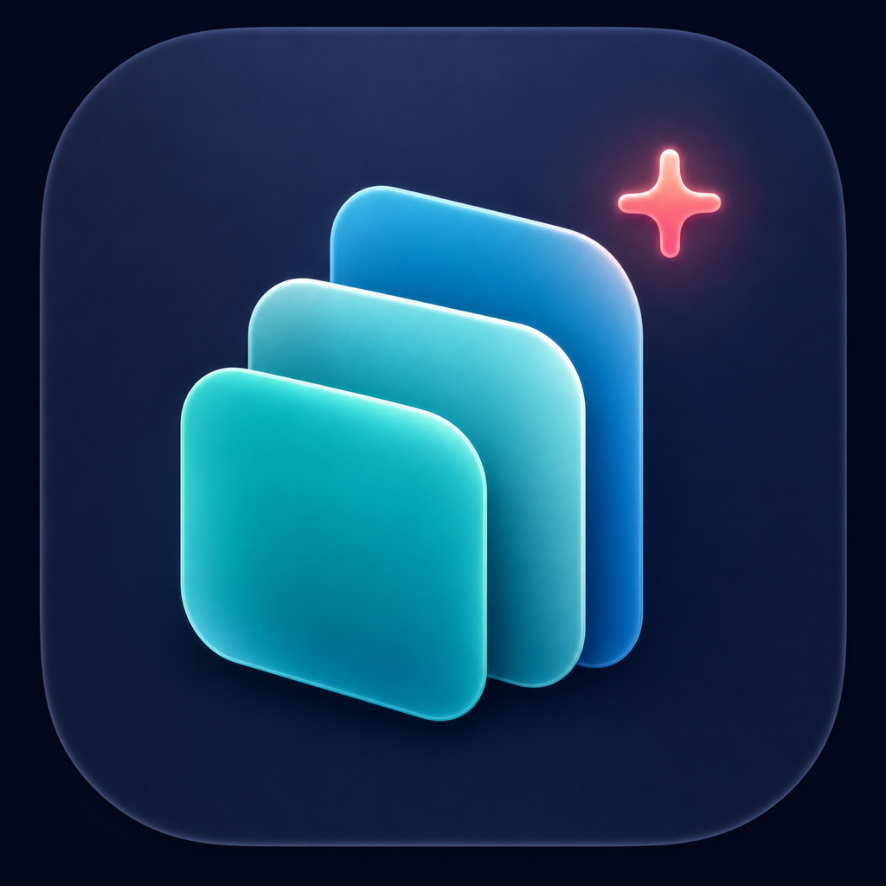

# ClipCanvas

<p align="center">
  
</p>

**ClipCanvas** 是一款原生、开源、本地优先的 macOS 剪贴板管理器。它提供横向卡片历史、Pinboard、键盘快速粘贴、隐私过滤和经过授权的 MCP 接入，不包含 iCloud、订阅、遥测或付费功能。

## 功能

| 模块 | 能力 |
|---|---|
| 剪贴板 | 文本、富文本、URL、图片、多文件；250 ms 轮询；内容去重与复制次数合并 |
| 浏览 | 屏幕底部横向卡片、全文搜索、来源应用、类型预览、方向键导航 |
| 粘贴 | 粘贴到前台应用、仅写入剪贴板、强制纯文本、`⌘1…9` Quick Paste |
| Pinboard | 内置 Useful Links、自定义 Pinboard、固定、浏览与删除 |
| 隐私 | 忽略应用、confidential/transient 标记、secret 启发式、屏幕共享保护 |
| 设置 | 登录启动、音效、保留周期、可编辑全局快捷键、英文与简体中文 |
| MCP | MCP `2025-11-25`、回环 HTTP、stdio bridge、读/写/管理作用域、撤销与审计 |

## 系统要求

| 项目 | 要求 |
|---|---|
| macOS | **14.0+** |
| Xcode / Swift | Swift 6 工具链（推荐 Xcode 16+） |
| 架构 | Apple Silicon 或 Intel |
| 网络 | 核心功能不需要；仅在用户开启链接预览时访问目标网页 |

## 构建与运行

```bash
git clone <your-fork-url>
cd paste-copy
./scripts/run-tests.sh
./scripts/build-app.sh release
open build/ClipCanvas.app
```

`build-app.sh` 会构建主应用和 `clipcanvas-mcp` stdio bridge、生成 `.icns`，并对本地产物进行 ad-hoc 签名。

### 安装到 Applications

```bash
cp -R build/ClipCanvas.app /Applications/
open /Applications/ClipCanvas.app
```

本地源码构建不会带 Developer ID 公证。macOS 首次阻止启动时，请在 Finder 中右键应用并选择“打开”，或前往“系统设置 → 隐私与安全性”确认；无需关闭 Gatekeeper。

## 权限

| 权限 | 何时需要 | 不授予时 |
|---|---|---|
| **辅助功能 Accessibility** | 自动向刚才的前台应用发送 `⌘V` | 自动降级为“仅写入剪贴板”，可手动粘贴 |
| **登录项** | 用户开启“登录时打开” | 不影响其他功能 |
| **网络** | 用户主动开启链接预览 | 不生成网页标题，历史内容仍正常保存 |

应用为菜单栏 Agent（`LSUIElement`），默认快捷键为 `⇧⌘V`。若与其他剪贴板工具冲突，可在 Settings → Shortcuts 中修改。

## 本地数据

```text
~/Library/Application Support/ClipCanvas/
├── clipcanvas.sqlite3
└── blobs/
```

- SQLite 保存元数据、全文索引、Pinboard、MCP 授权哈希与审计事件。
- 大型表示使用 SHA-256 内容寻址文件保存。
- MCP 令牌只显示一次，数据库只保存令牌哈希。
- ClipCanvas 没有 iCloud、CloudKit、订阅、账号系统或遥测。

## MCP 与 AI 工具

MCP **默认关闭**。在 Settings → MCP & AI Tools 中启用后，添加客户端、选择 `read` / `write` / `manage` 作用域，再复制一次性配置。

```json
{
  "mcpServers": {
    "clipcanvas": {
      "command": "/Applications/ClipCanvas.app/Contents/Helpers/clipcanvas-mcp",
      "env": {
        "CLIPCANVAS_TOKEN": "一次性令牌"
      }
    }
  }
}
```

| 安全边界 | 实现 |
|---|---|
| HTTP | 只监听 `127.0.0.1:49219`，只接受 `/mcp` |
| 客户端 | Bearer token；令牌仅存 SHA-256 哈希；可即时撤销 |
| 浏览器来源 | 拒绝非 localhost 的 `Origin` |
| 数据量 | HTTP body 与单项表示响应均限制为 2 MiB |
| 权限 | 工具按 `read`、`write`、`manage` 分级 |
| 审计 | 记录客户端、方法、结果和条目 ID，不记录剪贴板正文 |

可用工具：`clipboard_list`、`clipboard_search`、`clipboard_read`、`clipboard_write`、`clipboard_pin`、`clipboard_delete`、`pinboard_list`、`pinboard_read`、`pinboard_create`、`pinboard_delete`。

## 已知限制

- macOS 没有统一公开的“正在屏幕共享”状态 API，检测采用保守的尽力策略。
- 自动粘贴依赖 Accessibility；安全输入框与受保护应用可能拒绝模拟按键。
- 链接预览默认关闭；开启后最多读取目标页面前 1 MiB。
- 当前发布脚本生成本地 ad-hoc 签名产物；正式分发应替换为 Developer ID 签名和公证。
- 不实现云同步、非 macOS 客户端和自动更新。

## 开发

```bash
swift test
swift build --product ClipCanvas
swift build --product clipcanvas-mcp
```

架构说明见 [docs/ARCHITECTURE.md](docs/ARCHITECTURE.md)，完整验收记录见 [docs/ACCEPTANCE.md](docs/ACCEPTANCE.md)。

## 许可证

[MIT](LICENSE) © 2026 ClipCanvas contributors
