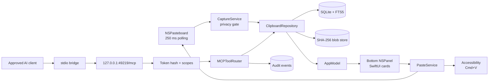
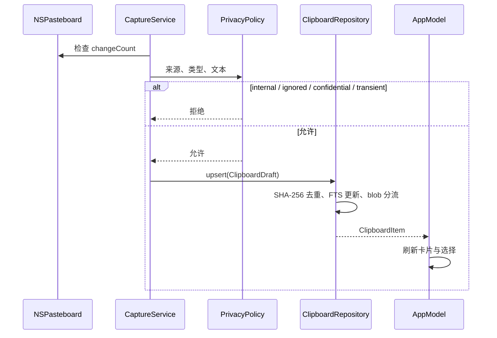
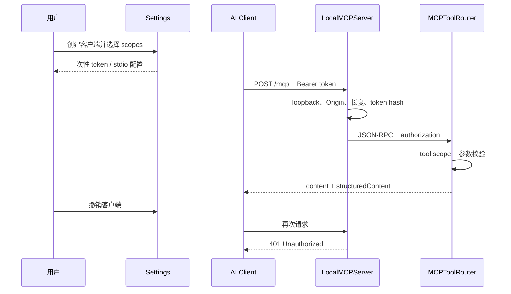

# ClipCanvas Architecture

## 总览

## 模块

| 模块 | 职责 | 关键类型 |
|---|---|---|
| `ClipCanvasCore` | 数据模型、SQLite、blob、隐私、保留、MCP 协议与工具 | `ClipboardRepository`, `PrivacyPolicy`, `MCPToolRouter` |
| `ClipCanvasApp` | 菜单栏 Agent、捕获、粘贴、全局面板、设置、HTTP MCP | `AppDelegate`, `CaptureService`, `PanelController`, `LocalMCPServer` |
| `ClipCanvasMCPBridge` | newline-delimited stdio ↔ 本机 HTTP | `ClipCanvasMCPBridge` |

## 剪贴板写入流程

## MCP 授权流程

## 存储

| 数据 | 位置 | 策略 |
|---|---|---|
| 历史元数据 | `clipcanvas.sqlite3` | FTS5；按 `last_copied_at` 保留 |
| 小表示 | `item_representations.inline_data` | 默认阈值 64 KiB |
| 大表示 / 图片 | `blobs/<hash prefix>/…` | SHA-256 内容寻址 |
| MCP 客户端 | `authorized_clients` | 只存 token SHA-256 |
| MCP 审计 | `audit_events` | 方法、结果、条目 ID；无正文 |

## 线程与生命周期

- UI、设置和 AppKit 控制器在 `MainActor`。
- SQLite 使用 `FULLMUTEX` 与递归锁封装事务。
- 剪贴板轮询在主 RunLoop 的轻量 Timer 上，重数据进入 blob 文件。
- MCP listener 使用独立串行队列，每连接只处理一个有界 HTTP/1.1 请求后关闭。
