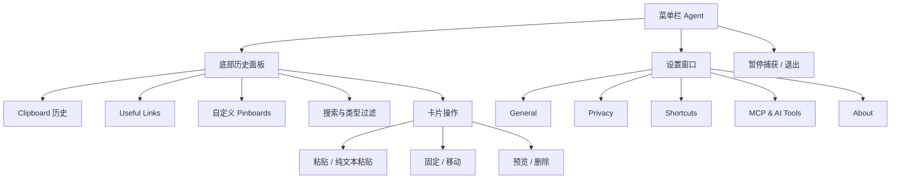
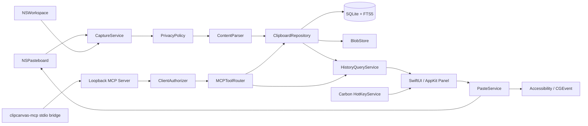
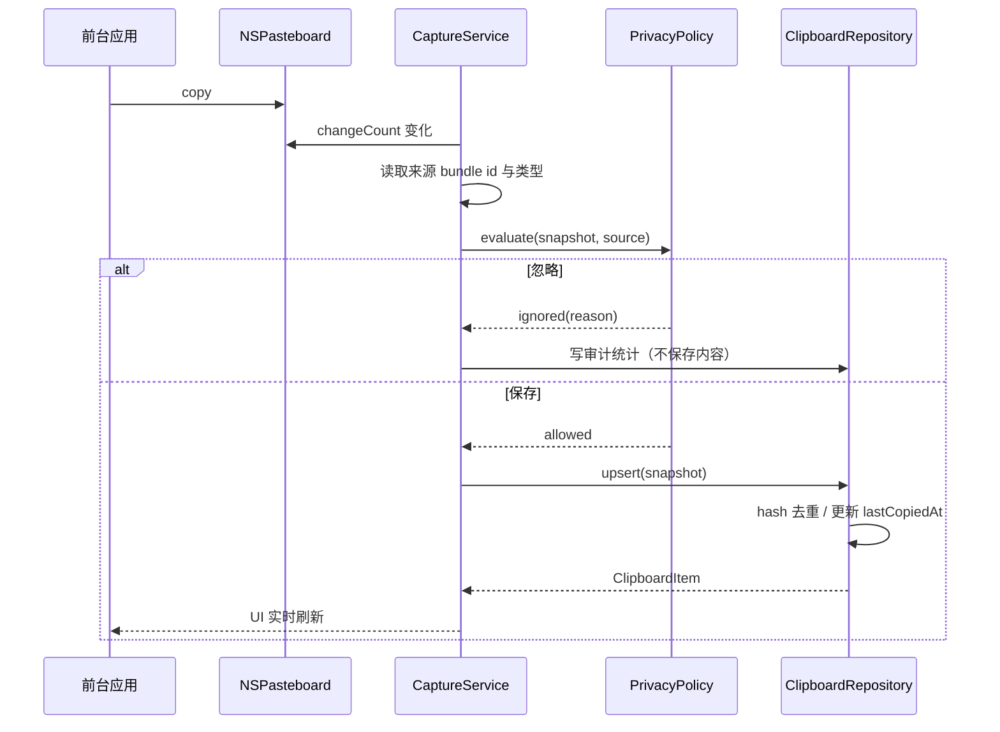
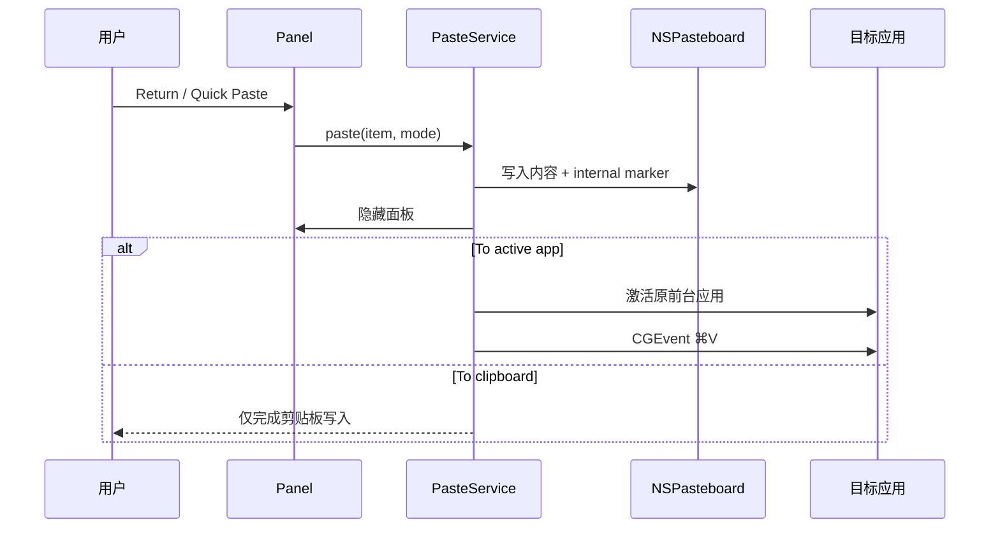
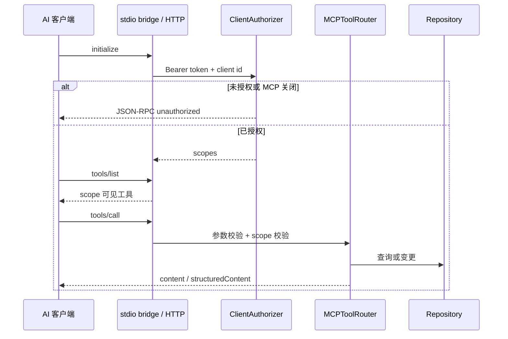
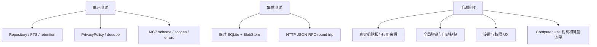

# ClipCanvas 产品与技术设计

> 日期：2026-07-17  
> 状态：已批准，可进入实施  
> 原始需求：[HANDOFF.md](../../HANDOFF.md)

## 1. 产品定义

| 项目 | 决策 |
|---|---|
| 开源名称 | **ClipCanvas** |
| 仓库名 | `paste-copy`（保留） |
| Bundle ID | `dev.clipcanvas.app` |
| 平台 | macOS 14+，Apple Silicon 与 Intel |
| 技术栈 | Swift 6、SwiftUI、AppKit、SQLite3 |
| 分发 | 非 App Sandbox；本地签名或 Developer ID |
| 许可证 | MIT |
| 数据边界 | 默认完全本地；仅链接预览会按开关访问网络 |
| 商业能力 | 无订阅、无付费墙、无 iCloud |
| 对标目标 | 对齐 Paste 的主要能力、信息架构、快捷键与交互意图，使用原创品牌与视觉 |

### 1.1 成功标准

| 领域 | 可验证结果 |
|---|---|
| 捕获 | 在常见应用复制文本、URL、图片或文件后 1 秒内进入历史 |
| 召回 | `⇧⌘V` 呼出底部面板；方向键、回车、数字快捷键可完成粘贴 |
| 管理 | 搜索、删除、置顶、Pinboard CRUD、保留期限与清空历史有效 |
| 隐私 | transient/concealed 数据和黑名单应用默认不入库；敏感模式可关闭 |
| 设置 | General、Privacy、Shortcuts、MCP & AI Tools、About 完整可用 |
| MCP | 未授权请求失败；授权客户端可按 scope 调用工具；关闭后全部失效 |
| 开源 | 干净环境可按 README 构建 `.app` 与 MCP bridge，并通过测试 |

## 2. 已确认的对标证据

| 来源 | 已确认内容 |
|---|---|
| Handoff 五张截图 | 横向卡片历史、顶部 Pinboard 导航、General/Privacy/Shortcuts/MCP 信息架构 |
| 本机 Paste 6.6.3 | `LSUIElement=true`、最低 macOS 14、主面板为底部横向卡片流 |
| 本机主界面 | `Useful Links` 是独立 Pinboard，`Clipboard` 是历史流，支持创建 Pinboard |
| 本机设置 | 默认快捷键、隐私项、保留期限、两种粘贴策略与 MCP 文案均与截图一致 |
| MCP 2025-11-25 稳定规范 | 标准传输为 stdio 与 Streamable HTTP；本地 HTTP 应只绑定 loopback、验证 Origin 并鉴权 |

## 3. 范围

### 3.1 P0

| 子系统 | 能力 |
|---|---|
| Clipboard | 监听、解析、去重、存储、保留、搜索、预览、删除、清空 |
| 类型 | 纯文本、RTF、HTML、URL、图片、单/多文件 |
| Paste | 仅写剪贴板、粘贴前台应用、始终纯文本、临时按 Shift 纯文本 |
| Panel | 底部浮层、横向卡片、类型色、来源图标、键盘导航、Quick Paste |
| Pinboard | 默认 Useful Links、自定义 Pinboard、固定/取消固定、切换与排序 |
| Privacy | 忽略应用、confidential、transient、链接预览、屏幕共享保护 |
| Shortcuts | 全局呼出、Stack、前后 Pinboard、Quick Paste、重置、冲突提示 |
| Lifecycle | 菜单栏常驻、开机启动、权限引导、音效 |
| MCP | stdio bridge、Streamable HTTP、授权客户端、scope、审计与设置 UI |
| Open source | README、LICENSE、贡献指南、构建脚本、CI、手动验收表 |

### 3.2 明确非目标

| 不做 | 原因 |
|---|---|
| iCloud / CloudKit | 需求明确排除 |
| 订阅与功能墙 | 开源学习项目 |
| App Store Sandbox | 会显著削弱前台应用识别、自动粘贴和本地集成 |
| 官方品牌与素材 | 避免商标与视觉复制 |
| 官方后端或私有协议 | 无必要且不合规 |
| 非 macOS 客户端 | 当前仅做原生 macOS |

## 4. 信息架构



### 4.1 主面板

| 区域 | 设计 |
|---|---|
| 位置 | 当前屏幕底部，左右各 12pt，自动适配 Dock |
| 材质 | 深色半透明原创材质；高对比边框与青蓝/紫红强调色 |
| 顶栏 | 搜索、Pinboard 切换、Clipboard、创建 Pinboard、更多 |
| 卡片流 | 240×180pt 左右，横向滚动，第一张为最新；可适应屏幕宽度 |
| 卡片头 | 类型标签、相对时间、来源 App 图标 |
| 卡片体 | 文本摘要、图片缩略图、URL 标题、文件列表 |
| 卡片脚 | 字符数、图片尺寸、文件数/大小、域名 |
| 选中态 | 2pt 品牌色描边、轻微抬升、Quick Paste 数字角标 |
| 空状态 | 清晰说明当前 Pinboard/搜索无结果及下一步动作 |

### 4.2 键盘交互

| 输入 | 行为 |
|---|---|
| `⇧⌘V` | 呼出/关闭 Clipboard |
| `⇧⌘C` | 呼出 Stack（最近复制的多条选择模式） |
| `←` / `→` | 在卡片间移动 |
| `⌘←` / `⌘→` | 前后 Pinboard |
| `Return` | 按设置执行粘贴 |
| `⌘1…9` | Quick Paste 对应可见卡片 |
| 按住 `Shift` | 当前动作强制纯文本 |
| `⌘F` | 聚焦搜索 |
| `Space` | Quick Look 风格大预览 |
| `⌫` | 二次确认后删除 |
| `Escape` | 退出搜索或关闭面板 |

## 5. 系统架构



### 5.1 模块边界

| 模块 | 职责 | 不负责 |
|---|---|---|
| `ClipCanvasCore` | 模型、SQLite、查询、隐私策略、MCP 协议核心 | AppKit 生命周期与界面 |
| `ClipCanvasApp` | 菜单栏、窗口、捕获、粘贴、快捷键、设置 UI | 直接拼 SQL |
| `ClipCanvasMCPBridge` | 将 stdio JSON-RPC 安全转发到本地 App | 直接读取数据库 |
| `ClipCanvasCoreTests` | 数据层、策略、协议与权限测试 | 真实辅助功能操作 |
| `ClipCanvasAppTests` | 视图模型与服务边界测试 | 像素级快照 |

## 6. 数据流

### 6.1 捕获



### 6.2 粘贴



### 6.3 MCP



## 7. 数据模型

### 7.1 SQLite

| 表 | 关键字段 | 约束 |
|---|---|---|
| `clipboard_items` | `id`, `kind`, `plain_text`, `title`, `source_bundle_id`, `source_name`, `source_icon_path`, `content_hash`, `created_at`, `last_copied_at`, `copy_count`, `is_sensitive`, `metadata_json` | `content_hash` 索引；时间索引 |
| `item_representations` | `id`, `item_id`, `uti`, `storage`, `inline_data`, `file_path`, `byte_count` | item 删除级联 |
| `clipboard_fts` | `plain_text`, `title`, `source_name` | FTS5 外部内容表 |
| `pinboards` | `id`, `name`, `color`, `symbol`, `sort_index`, `is_system`, `created_at` | `Useful Links` 为系统 Pinboard |
| `pinboard_items` | `pinboard_id`, `item_id`, `sort_index`, `created_at` | 联合主键 |
| `authorized_clients` | `id`, `display_name`, `token_hash`, `scopes`, `created_at`, `last_used_at`, `revoked_at` | 只存 token SHA-256 |
| `audit_events` | `id`, `client_id`, `method`, `item_id`, `outcome`, `created_at`, `detail` | 不记录完整剪贴板内容 |

### 7.2 Swift 模型

| 类型 | 关键属性 |
|---|---|
| `ClipboardItem` | UUID、类型、摘要、来源、时间、hash、元数据、representations |
| `ClipboardKind` | `text`, `richText`, `image`, `link`, `files`, `unknown` |
| `ClipboardRepresentation` | UTI、存储形式、data/path、字节数 |
| `Pinboard` | UUID、名称、颜色、symbol、system 标记、排序 |
| `AppSettings` | General、Privacy、快捷键、MCP 设置 |
| `AuthorizedClient` | UUID、名称、scopes、授权/撤销时间、最近使用 |
| `MCPClientScope` | `read`, `write`, `manage` |

### 7.3 文件布局

```text
~/Library/Application Support/ClipCanvas/
├── clipcanvas.sqlite3
├── blobs/
│   └── ab/cd/<sha256>.<ext>
├── connection.json
└── logs/
    └── clipcanvas.log
```

## 8. 捕获与类型策略

| 输入 | 主表示 | 附加表示 | 预览 |
|---|---|---|---|
| 纯文本 | UTF-8 text | — | 最多 800 字符 |
| 富文本 | plain fallback | RTF、HTML | 以纯文本预览，粘贴保留原始格式 |
| URL | absolute URL | 原始 text | 域名、标题、可选 Open Graph |
| 图片 | PNG 或原格式 | TIFF fallback | 缩略图、像素尺寸 |
| 文件 | file URLs | 多文件列表 | 图标、名称、路径、数量 |
| 未知 | 可安全持久化的 UTI | 原始 data | 类型名与大小 |

### 8.1 去重

| 情况 | 行为 |
|---|---|
| 与最新条目 hash 相同 | 不新增；更新 `lastCopiedAt` 与 `copyCount` |
| 与较早条目相同 | 将原条目更新时间置新，保持 Pinboard 关系 |
| ClipCanvas 自己写入 | internal marker 命中时不再次捕获 |
| 同次多表示 | 合并为一个 item，而非每个 UTI 一条 |

## 9. 隐私与权限

### 9.1 默认值

| 设置 | 默认 |
|---|---|
| Show During Screen Sharing | 关 |
| Generate Link Previews | 关 |
| Ignore confidential content | 开 |
| Ignore transient content | 开 |
| Ignore Applications | Passwords、Keychain Access、常见密码管理器（可编辑） |
| Enable MCP | 关 |

### 9.2 忽略规则优先级

1. ClipCanvas internal marker。
2. 来源 bundle id 黑名单。
3. transient / concealed / auto-generated pasteboard UTI。
4. 密码管理器专用 UTI。
5. confidential 启发式：私钥头、常见 token/secret 赋值、银行卡/身份信息高置信模式。
6. 用户显式允许的普通内容。

启发式只对“高置信且长度合理”的模式生效，避免普通代码片段被大面积误杀；设置页提供说明和开关。

### 9.3 屏幕共享

`NSWindow.sharingType = .none` 在现代 macOS 不能可靠阻止录屏，因此不作为安全承诺。实现采用：

| 状态 | 行为 |
|---|---|
| 用户允许共享时显示 | 正常显示 |
| 用户禁止共享时显示 | 监听系统屏幕捕获/共享状态的尽力检测；命中时关闭面板并阻止再次呼出 |
| 无法可靠判断 | 设置页明确标注“尽力保护”；菜单提供一键 Pause |

### 9.4 权限 UX

| 权限 | 触发时机 | 无权限降级 |
|---|---|---|
| Accessibility | 首次选择“To active app”时按需申请 | 自动回退“To clipboard”，不阻塞历史管理 |
| Login Item | 用户打开 Open at login | 展示系统授权状态与跳转设置 |
| Network | 打开 Generate Link Previews 后 | 关闭时绝不发起预览请求 |
| MCP | 用户启用并创建客户端授权 | 默认无监听、无 token、无访问 |

## 10. 设置

### 10.1 General

| 设置项 | 实现 |
|---|---|
| Open at login | `SMAppService.mainApp.register/unregister` |
| Sound effects | 本地系统音效，可关闭 |
| Paste Items | `activeApp` / `clipboardOnly` |
| Always paste as Plain Text | 全局策略 |
| Keep History | Day / Week / Month / Year / Forever |
| Erase History | 二次确认，保留 Pinboard 或全清可选择 |

### 10.2 Privacy

与第 9 节一致；忽略应用使用 `NSOpenPanel` 选择 `.app`，保存 bundle id 与显示名。

### 10.3 Shortcuts

| 动作 | 默认 | 实现 |
|---|---|---|
| Activate ClipCanvas | `⇧⌘V` | Carbon `RegisterEventHotKey` |
| Activate Stack | `⇧⌘C` | Carbon |
| Next/Previous Pinboard | `⌘→` / `⌘←` | 面板级事件监听 |
| Quick Paste | `⌘1…9` | 面板级事件监听 |
| Plain Text mode | 按住 `⇧` | 当前 NSEvent modifierFlags |

快捷键录制器禁止只有字母/数字而无修饰键的全局组合，检测本应用内部重复并显示冲突。

### 10.4 MCP & AI Tools

| 控件 | 行为 |
|---|---|
| Enable MCP | 启停 loopback server；关闭后所有请求失败 |
| Add Client | 输入显示名与 scope，生成一次性明文 token |
| Authorized Clients | 展示名称、scope、最近使用、撤销 |
| Copy Config | 复制 stdio 客户端 JSON；token 仅创建时可复制 |
| Audit | 展示最近调用的方法、时间与结果，不展示完整内容 |

### 10.5 About

展示版本、MIT 许可、源码入口、隐私说明与致谢；不出现订阅。

## 11. MCP 设计

### 11.1 传输

| 传输 | 用途 | 地址 |
|---|---|---|
| Streamable HTTP | App 内常驻服务 | `http://127.0.0.1:49219/mcp` |
| stdio | Claude Desktop/Cursor 等客户端 | `.app/Contents/Helpers/clipcanvas-mcp` |

HTTP 只绑定 `127.0.0.1`；有 `Origin` 时仅接受 loopback origin；所有请求要求 `Authorization: Bearer <token>`。stdio bridge 从环境变量 `CLIPCANVAS_TOKEN` 或用户级配置读取 token，stdout 只输出 JSON-RPC。

### 11.2 协议

| 项 | 值 |
|---|---|
| 稳定协议版本 | `2025-11-25` |
| Server name | `clipcanvas` |
| Capabilities | `tools`, `resources` |
| 初始化 | `initialize` → `notifications/initialized` |
| 工具列表 | 按名称稳定排序 |
| 变更通知 | 授权 scope 变化时重新连接生效 |

### 11.3 工具清单

| 工具 | Scope | 输入 |
|---|---|---|
| `clipboard_list` | read | `limit`, `cursor`, `kind`, `since` |
| `clipboard_search` | read | `query`, `limit`, `cursor` |
| `clipboard_read` | read | `id`, `includeRepresentations` |
| `pinboard_list` | read | 无 |
| `pinboard_read` | read | `id`, `limit`, `cursor` |
| `clipboard_write` | write | `text`, `url`, `pinboardId` |
| `clipboard_pin` | write | `itemId`, `pinboardId` |
| `clipboard_delete` | write | `id` |
| `pinboard_create` | manage | `name`, `color`, `symbol` |
| `pinboard_delete` | manage | `id` |

图片默认只返回元数据和受控本地路径；只有 `includeRepresentations=true` 且 read scope 有效时才返回 base64，并设置 2 MiB 上限。

### 11.4 资源

| URI | 含义 |
|---|---|
| `clipcanvas://clipboard/recent` | 最近历史摘要 |
| `clipcanvas://pinboards` | Pinboard 列表 |
| `clipcanvas://pinboard/{id}` | Pinboard 内容摘要 |

### 11.5 错误

| 场景 | JSON-RPC / HTTP |
|---|---|
| MCP 关闭 | HTTP 503 / `-32001` |
| token 缺失或错误 | HTTP 401 / `-32002` |
| scope 不足 | HTTP 403 / `-32003` |
| 参数错误 | `-32602` |
| 条目不存在 | `-32004` |
| 内容过大 | `-32005` |

## 12. 错误处理与恢复

| 故障 | 策略 |
|---|---|
| SQLite 打开失败 | 尝试只读诊断；主界面展示恢复入口，不覆盖原库 |
| Blob 写入失败 | 不提交 DB 事务；记录非敏感错误 |
| 端口占用 | 设置页显示占用错误；不退化为随机外网监听 |
| 辅助功能未授权 | 回退到剪贴板模式并提供设置入口 |
| 链接预览失败 | 保留 URL 条目；静默显示域名，不重试轰炸 |
| 无效快捷键 | 拒绝保存并保留旧值 |
| MCP bridge 无法连接 | stderr 输出明确诊断，stdout 保持协议纯净 |

## 13. 性能

| 指标 | 目标 |
|---|---|
| 捕获延迟 | 轮询 250ms；95% 在 1 秒内入库 |
| 主面板首帧 | 热启动 < 250ms |
| 搜索 | 10 万条文本历史下前 50 条 < 100ms |
| 内存 | 不在列表同时解码全部大图；缩略图按需缓存 |
| 存储 | 图片/大表示走 BlobStore；SQLite 只存索引与小文本 |
| 清理 | 启动后与每日后台运行；事务批量删除 |

## 14. 本地化与可访问性

| 项目 | 要求 |
|---|---|
| 语言 | `en` 与 `zh-Hans` |
| 字符串 | 所有用户可见文案使用 String Catalog / Localizable |
| VoiceOver | 卡片读出类型、来源、时间、摘要与位置 |
| 动效 | 尊重 Reduce Motion |
| 对比度 | 文本与背景满足 WCAG AA 目标 |
| 键盘 | 全流程无需鼠标可完成 |

## 15. 测试策略



### 15.1 自动测试重点

| 编号 | 行为 |
|---|---|
| T1 | 连续相同内容只保留一条并增加 copyCount |
| T2 | transient、concealed、黑名单来源与高置信 secret 被忽略 |
| T3 | Day/Week/Month/Year 清理边界正确且 Pinboard 策略明确 |
| T4 | 文本、URL、图片、文件模型可往返 SQLite |
| T5 | 搜索按文本、标题、来源返回稳定分页 |
| T6 | MCP 未授权/错误 scope/关闭时拒绝 |
| T7 | MCP 工具 schema 与调用结果符合 JSON-RPC |
| T8 | token 只保存 hash，撤销立即生效 |

### 15.2 手动验收

采用 `docs/ACCEPTANCE.md` 逐项记录日期、系统版本、结果和证据截图。

## 16. 分阶段交付

| Phase | 可运行结果 | 完成门槛 |
|---|---|---|
| 0 | `.app`、菜单栏、空面板、设置壳 | Debug 构建成功 |
| 1 | 复制→入库→展示→写回剪贴板/自动粘贴 | 核心测试与真实复制通过 |
| 2 | 搜索、类型卡片、保留、音效、快捷键 | 键盘闭环通过 |
| 3 | Pinboard、Privacy、链接预览 | 隐私与 CRUD 测试通过 |
| 4 | MCP HTTP/stdio、授权、审计、设置 | 未授权拒绝与授权调用通过 |
| 5 | 本地化、README、LICENSE、CI、打包 | 干净构建与验收表通过 |

## 17. 风险与取舍

| 风险 | 处理 |
|---|---|
| macOS 不提供可靠的“其他 App 正在共享屏幕”统一 API | 尽力检测 + Pause + 清晰文案；不作绝对安全承诺 |
| Accessibility 权限影响直接粘贴 | 核心仍可“仅写剪贴板”，提供可恢复引导 |
| 未沙盒分发会触发 Gatekeeper 信任成本 | README 解释签名与源码构建；不建议关闭 SIP/Gatekeeper |
| secret 启发式误报 | 默认仅高置信规则、可关闭、规则有单测 |
| MCP 暴露敏感历史 | 默认关闭、显式 token、scope、loopback、Origin、审计、撤销 |
| SQLite/FTS 与大图片膨胀 | BlobStore、缩略图、定期清理、事务 |

## 18. 设计自审结论

| 检查 | 结果 |
|---|---|
| Placeholder | 无 TBD/TODO 或未决实现项 |
| 内部一致性 | 平台、权限、存储、MCP 与设置定义一致 |
| 范围 | 以 Phase 分解，但共享同一数据核心和最终产品 |
| 歧义 | Useful Links、富文本、多文件、MCP 传输、Sandbox 均已明确 |
| 非目标 | iCloud、订阅、官方品牌与非 macOS 平台均明确排除 |

