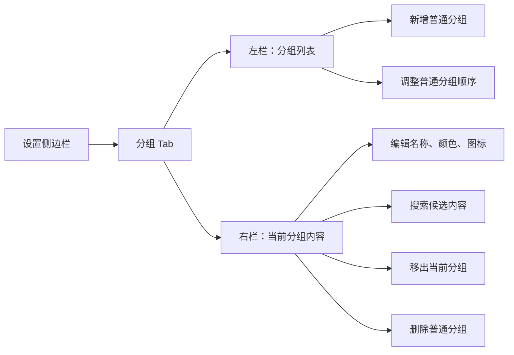
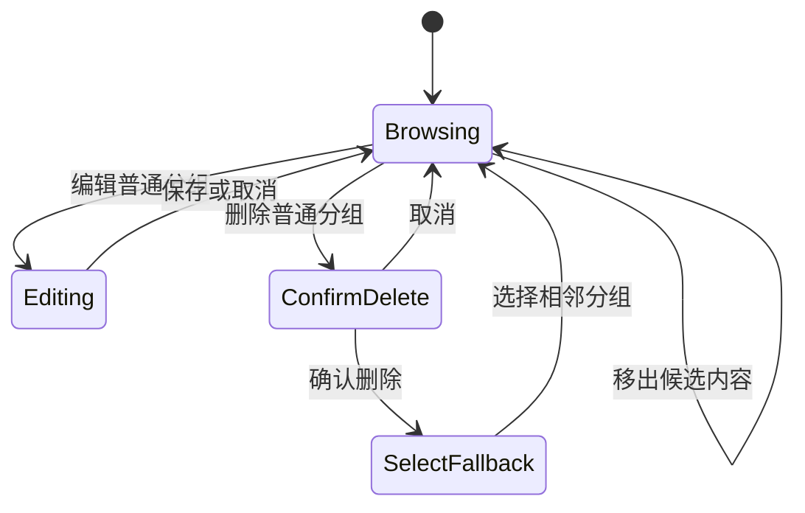
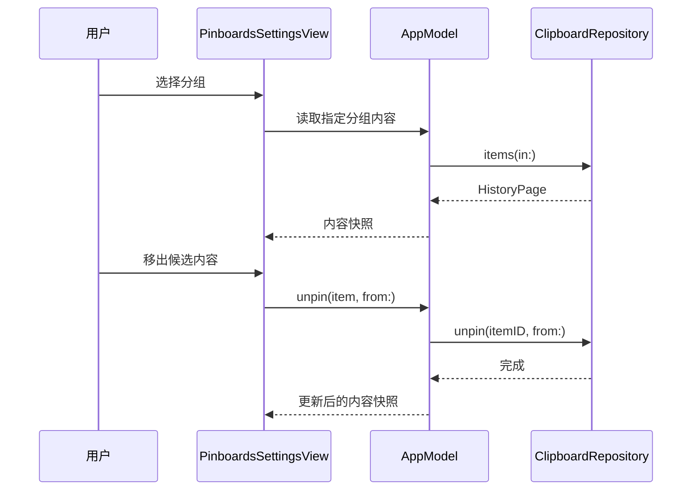

# 设置页分组管理设计

## 1. 目标

在设置窗口新增独立的“分组”Tab，让用户不打开剪贴板浮层也能完成分组维护，并安全整理分组中保存的候选粘贴内容。

| 目标 | 验收结果 |
|---|---|
| 集中管理 | 新增、编辑、排序、删除普通分组 |
| 内容整理 | 查看、搜索并将候选内容移出当前分组 |
| 数据安全 | 移出内容或删除分组均不删除剪贴板历史 |
| 系统保护 | Useful Links 可整理内容，但不能改名、改外观、排序或删除 |
| 状态同步 | 设置页修改后，主面板分组栏无需重启即可刷新 |

## 2. 方案比较

| 方案 | 优点 | 缺点 | 结论 |
|---|---|---|---|
| A：双栏维护 | 分组上下文稳定，切换与整理效率高 | 横向空间要求较高 | **采用** |
| B：分组卡片 + 详情页 | 展示轻松 | 频繁进出详情，维护效率低 | 不采用 |
| C：单一混合表格 | 信息密度高 | 分组属性与内容属性容易混淆 | 不采用 |

## 3. 信息架构

设置侧边栏在 General 后新增“分组”Tab。页面主体使用双栏：

| 区域 | 内容 | 主要操作 |
|---|---|---|
| 左栏 | Useful Links、普通分组 | 选择、新增、拖拽排序 |
| 右栏头部 | 当前分组名称、数量、外观 | 编辑普通分组、删除普通分组 |
| 右栏搜索 | 当前分组内搜索框 | 按标题、正文、来源过滤 |
| 右栏列表 | 候选粘贴内容 | 查看摘要、移出当前分组 |

“Clipboard”代表全量剪贴板历史，不是持久化 Pinboard，因此不进入本页面的分组维护列表，避免把“移出分组”误解成“永久删除历史”。



## 4. 交互规则

### 4.1 默认状态

| 场景 | 行为 |
|---|---|
| 首次进入 | 自动选中列表第一项，通常为 Useful Links |
| 没有分组 | 显示空状态与“新增分组”按钮 |
| 当前选择被删除 | 选择相邻分组；无剩余分组时显示空状态 |
| 主面板已选择某分组 | 设置页仍使用独立选择，不改变主面板上下文 |

### 4.2 分组维护

| 操作 | 普通分组 | Useful Links |
|---|---|---|
| 新增 | 支持 | 不适用 |
| 改名 | 支持，去除首尾空白且不能为空 | 禁止 |
| 修改颜色/图标 | 支持 | 禁止 |
| 排序 | 支持；系统分组固定在首位 | 固定 |
| 删除 | 二次确认 | 禁止 |

删除普通分组时只删除 Pinboard 及其成员关系。`clipboard_items` 与二进制内容保持不变，后续仍可从 Clipboard 历史找到。

### 4.3 候选内容维护

| 操作 | 行为 |
|---|---|
| 搜索 | 只过滤当前分组；忽略大小写，匹配标题、正文和来源 |
| 移出 | 立即解除当前 Pinboard 与该条目的关联 |
| 数据保留 | 不删除历史，也不影响该条目在其他 Pinboard 中的关系 |
| 空结果 | 区分“分组没有内容”和“搜索没有结果” |
| 加载上限 | 沿用仓储层单页上限，最多加载 200 项 |

### 4.4 危险操作



“移出候选内容”是可恢复的关系变更，不弹确认框；“删除分组”会影响整组关系，必须二次确认。

## 5. 视觉规范

页面沿用现有设置窗口的深色卡片体系，并在 620pt 内容宽度内保持稳定：

| 指标 | 建议值 |
|---|---|
| 左栏宽度 | 190pt |
| 双栏间距 | 12pt |
| 分组行高度 | 36pt |
| 内容行最小高度 | 58pt |
| 搜索框高度 | 30pt |
| 危险操作 | 红色文字按钮，仅在普通分组显示 |

选择态使用当前分组颜色的低饱和背景；非选择态保留清晰文字与图标。系统分组显示锁定标识，但不降低内容可读性。

## 6. 数据与代码设计

### 6.1 仓储层

在 `ClipboardRepository` 补齐分组元数据与排序能力：

| API | 职责 |
|---|---|
| `updatePinboard(id:name:color:symbol:)` | 更新普通分组元数据 |
| `reorderPinboards(ids:)` | 按给定普通分组 ID 顺序重写 `sort_index` |
| `unpin(itemID:from:)` | 复用现有 API，解除单个成员关系 |

`updatePinboard` 与 `reorderPinboards` 必须拒绝修改系统分组。排序在事务内完成，并将 Useful Links 固定为首项。

### 6.2 应用状态层

`AppModel` 继续作为仓储访问入口，并新增设置页所需动作：

| 动作 | 结果 |
|---|---|
| 读取分组内容 | 返回指定分组的独立内容快照 |
| 更新分组 | 刷新 `pinboards`，保留主面板选择 |
| 调整分组顺序 | 刷新主面板分组顺序 |
| 移出内容 | 更新仓储关系；必要时刷新主面板当前分组 |

设置页使用自己的 `selectedPinboardID`、搜索词和内容快照，不复用主面板的 `selectedPinboardID` 与 `items`。

### 6.3 视图层

新增 `PinboardsSettingsView`，并复用：

- `SettingsCard` 的卡片外观；
- `PinboardColorPalette` 的颜色定义；
- `PinboardEditorView` 的颜色和图标选择规则。

编辑表单提取为可同时支持“新增”和“编辑”的通用表单，提交前统一验证名称。

`SettingsRootView` 对该 Tab 使用全高详情容器，由左右两栏分别滚动；其余设置页继续沿用外层 `ScrollView`。这样避免 `List` 嵌套在滚动容器后高度不确定、拖拽排序失效或候选列表被压缩。



## 7. 错误与边界

| 场景 | 处理 |
|---|---|
| 空名称 | 阻止保存并显示本地化错误 |
| 分组已被其他界面删除 | 刷新列表并选择可用相邻项 |
| 系统分组被请求修改 | 仓储层拒绝，UI 同时隐藏入口 |
| 仓储读写失败 | 页面显示非阻塞错误提示，保留当前选择 |
| 移出当前主面板正在查看的内容 | 同步刷新主面板，避免显示失效成员 |

## 8. 本地化

英文与简体中文同时补齐：

- 设置侧边栏标题；
- 新增、编辑、排序、删除分组；
- 搜索与空状态；
- 移出分组；
- 删除确认与数据保留说明；
- 系统分组保护与错误信息。

## 9. 测试与验收

| 层级 | 覆盖点 |
|---|---|
| Repository | 更新普通分组、拒绝更新系统分组、事务排序、删除不删历史、unpin 不影响其他分组 |
| AppModel | 独立读取、更新后刷新、移出后同步、删除后的选择回退 |
| View state | 搜索过滤、系统分组操作禁用、空状态 |
| 回归 | 主面板 Clipboard 始终第一；现有 Pinboard 创建、删除、快捷键不受影响 |

验证命令：

```bash
swift test
swift build -c release
```

## 10. 首版非目标

- 永久删除单条剪贴板历史；
- 调整候选内容在分组内的顺序；
- 跨分组批量移动或复制；
- 分页浏览超过 200 项；
- 修改 Useful Links 的系统属性。
